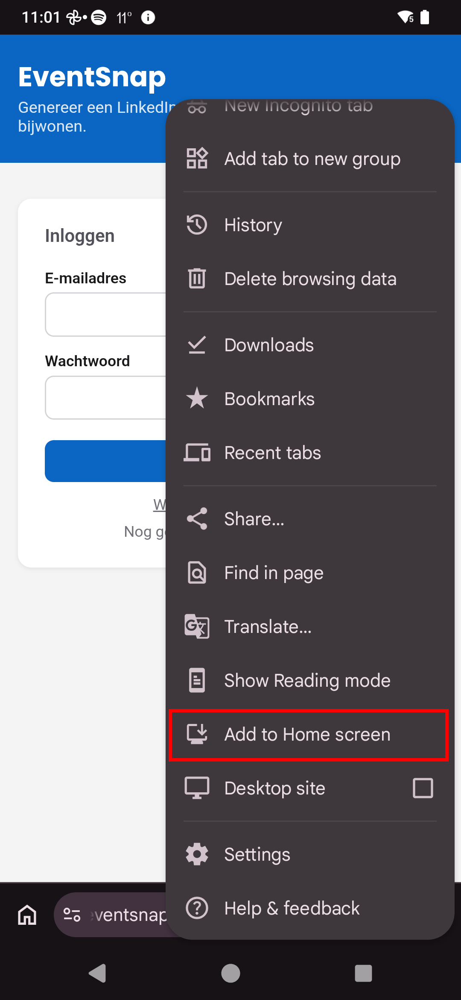
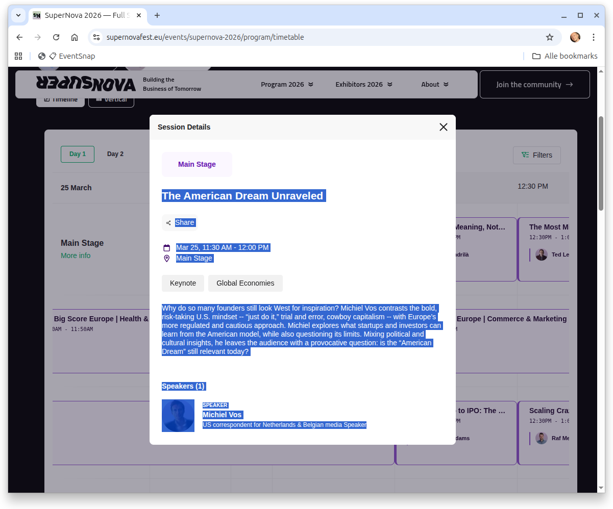
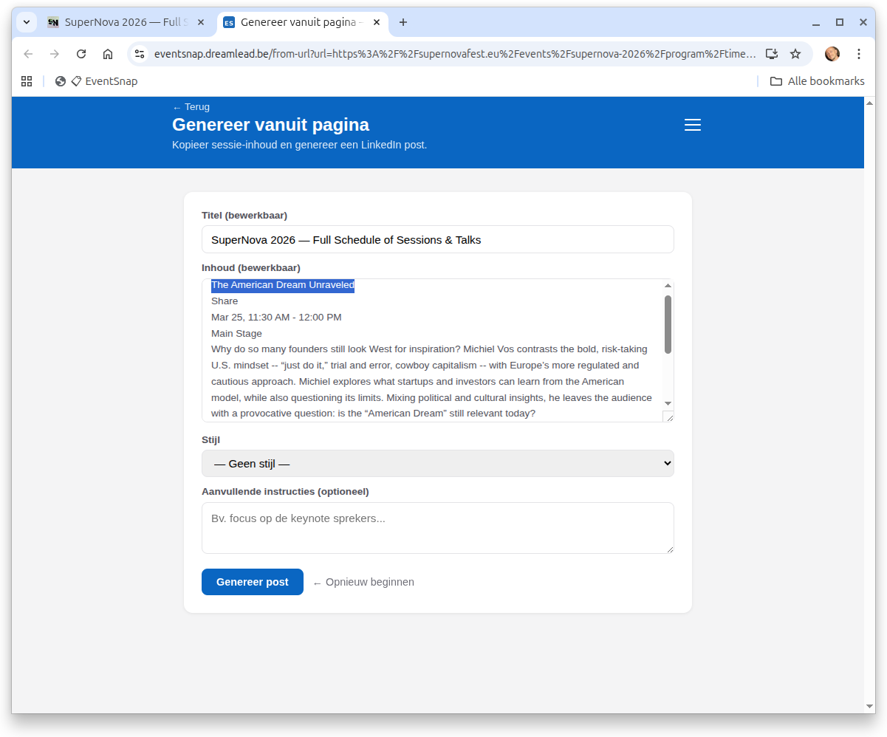
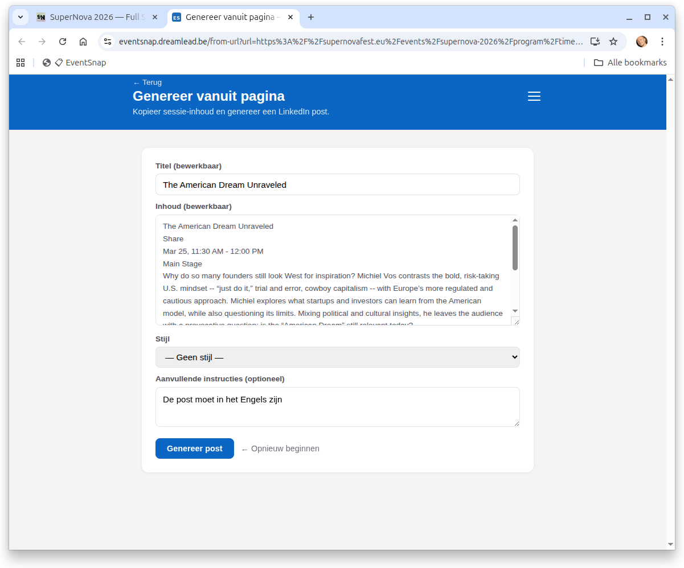
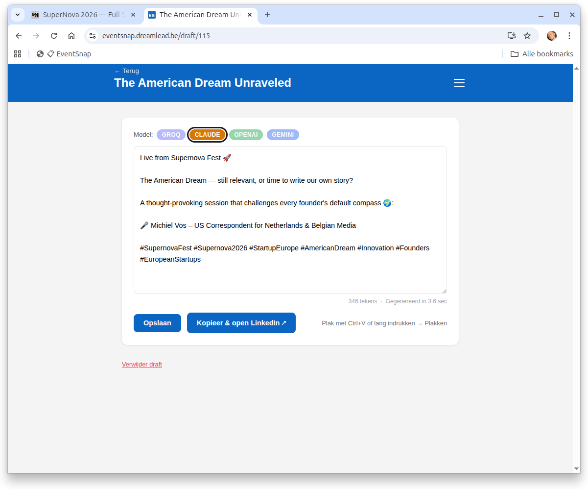
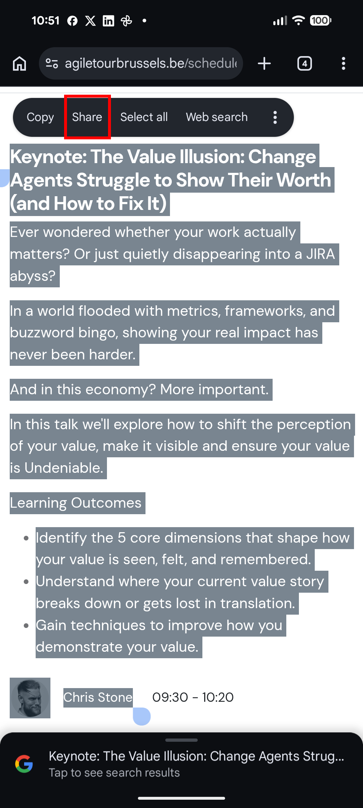
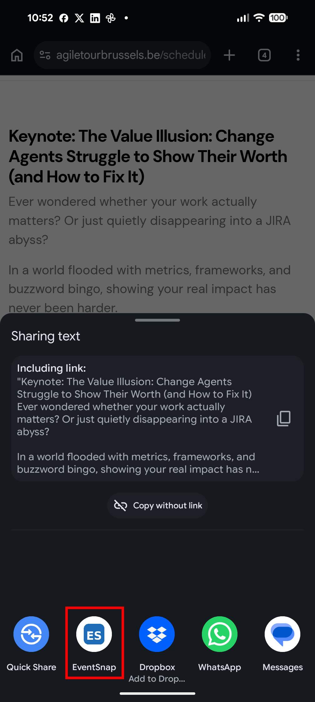
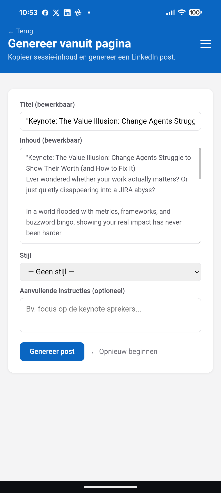

# EventSnap   — Usage Guide

EventSnap is available at **[eventsnap.dreamlead.be](https://eventsnap.dreamlead.be)**.

## How it works

There are two ways to generate a LinkedIn post:

1. **From your tickets** — EventSnap fetches your upcoming events from Collective or Eventbrite and generates a post for each one
2. **From any agenda page** — share or paste session text from any conference website and generate a post on the spot

In both cases, EventSnap sends the event content to the AI model of your choice and returns a ready-to-edit LinkedIn draft.

---

## Generating from tickets

1. Open EventSnap — your upcoming events are listed on the home screen
2. Select an event and click **Genereer post**
3. Optionally choose a style and add extra instructions (e.g. "write in English", "focus on the keynote")
4. The draft appears — edit it directly and copy it to LinkedIn

---

## Generating from any conference page

Use this when you're attending a session at an event that isn't in your ticket platforms, or when you want to post about a specific talk.

### Setup (once per device)

**Desktop** — install the bookmarklet:
> Right-click the **📋 EventSnap** button on the Settings page → **Bookmark this link**.
> Enable the bookmarks bar via `Ctrl+Shift+B` (Windows/Linux) or `Cmd+Shift+B` (Mac) if it's not visible.

**Android** — install EventSnap as an app:
> Open [eventsnap.dreamlead.be](https://eventsnap.dreamlead.be) in Chrome → tap the three dots → **Add to Home screen**.

**iOS (Safari)** — install EventSnap as an app:
> Open [eventsnap.dreamlead.be](https://eventsnap.dreamlead.be) in Safari → tap the Share icon → **Add to Home Screen**.

---

### Daily use

**Desktop — bookmarklet (recommended)**

1. Go to any agenda or session page
2. Select the session text (title + description + speaker)

   

3. Click the **EventSnap** bookmark in your bookmarks bar — the text opens directly in EventSnap

   

4. Optionally add extra instructions (e.g. "write in English", "focus on the Q&A")

   

5. Click **Genereer post** — the draft appears, ready to edit and copy

   

> No selection? The bookmarklet sends the page URL instead and EventSnap scrapes the full page.

**Desktop — paste (alternative)**

Useful when text is inside a popup or the bookmarklet isn't available:
1. Select and copy the session text (`Ctrl+C`)
2. Open [Genereer vanuit pagina](https://eventsnap.dreamlead.be/from-url)
3. Click **📋 Plakken**

> If the page blocks copying (`user-select: none`), paste the URL instead — EventSnap will scrape it server-side, bypassing the restriction.

**Android**

1. Go to any agenda page in your browser
2. Select the session text → tap **Share**

   

3. Choose **EventSnap** from the share sheet

   

4. The form opens pre-filled — add instructions if needed and tap **Genereer post**

   

> You can also share the page URL directly: tap the three dots → **Share** → **EventSnap**.

**iOS (Safari)**
1. Go to any agenda page
2. **Text**: select session text → tap **Share** → choose **EventSnap**
3. **URL**: tap the Share icon → choose **EventSnap**

---

## Getting started

**New here? Start with [SETUP.md](SETUP.md)** — it covers getting an API key (required), connecting event providers (optional), and what works with a minimal setup.

---

## Settings

### LLM (AI model)

Go to **Settings → Language model** to choose your AI model and paste your API key. EventSnap supports:

| Model | Cost | Where to get a key |
|---|---|---|
| Groq — Llama 3.3 70B | Free tier available | [console.groq.com](https://console.groq.com) |
| Claude — Sonnet 4.6 | From $3 / 1M tokens | [console.anthropic.com](https://console.anthropic.com) |
| OpenAI — GPT-4o mini | From $0.15 / 1M tokens | [platform.openai.com](https://platform.openai.com) |
| Gemini — 2.5 Flash | Free tier available | [aistudio.google.com](https://aistudio.google.com) |

Keys are validated immediately on paste and stored encrypted. Your spending per model is tracked and shown in settings.

### Styles

Go to **Stijlen** to save reusable prompt styles — for example a style that always writes in English, or one that focuses on networking opportunities. Apply a style per generation.

### Event providers

Go to **Settings → Event providers** to connect Collective (Odoo) or Eventbrite with your credentials. Once connected, your upcoming events appear on the home screen automatically.

---

## Account & security

- **2FA**: enable TOTP-based two-factor authentication under **Account → Twee-staps verificatie**
- **Email verification**: required on first login
- **Password change**: available under **Account**

---

*See [README.md](README.md) for self-hosting and deployment instructions.*
